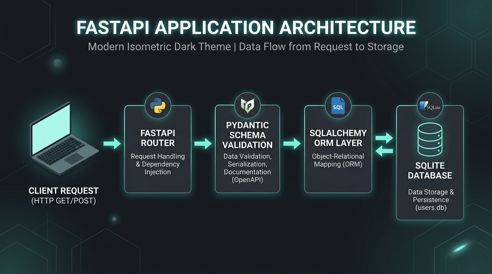
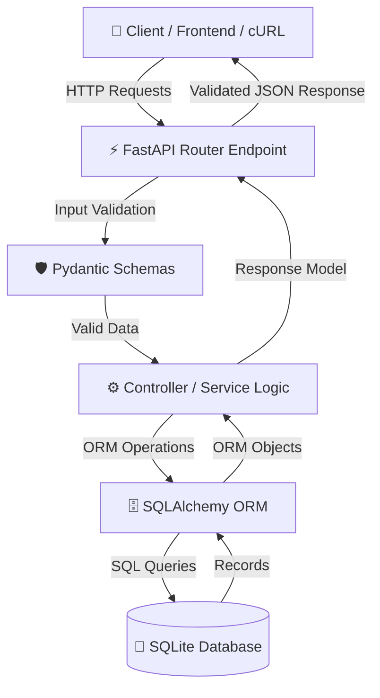
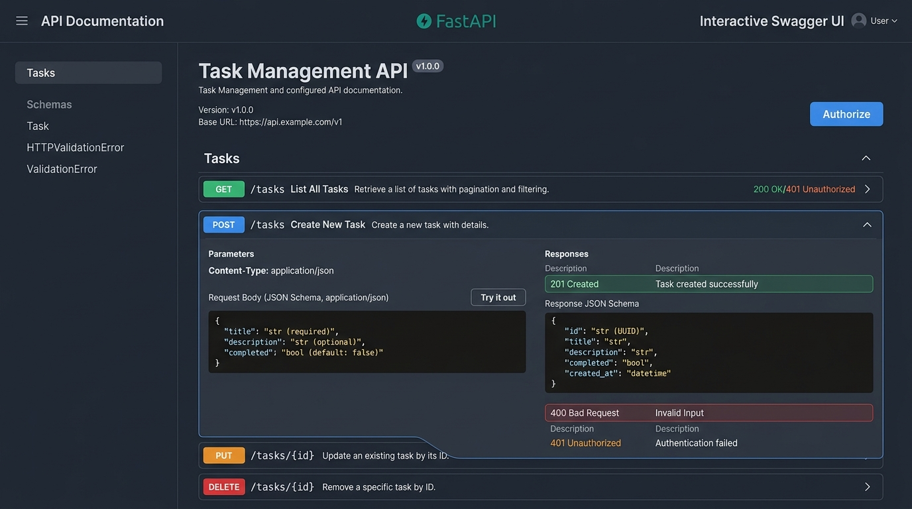
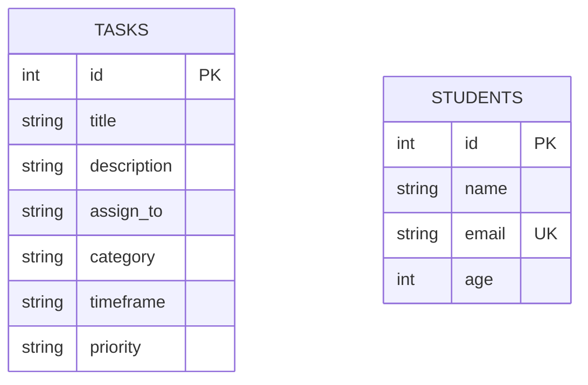

<div align="center">


# ⚡ FastAPI Modern REST API Suite

[](https://www.python.org/)
[](https://fastapi.tiangolo.com/)
[](https://www.sqlalchemy.org/)
[](https://docs.pydantic.dev/)
[](https://www.sqlite.org/)
[](http://127.0.0.1:8000/docs)

<p align="center">
  <b>A production-ready, highly modular FastAPI backend workspace featuring complete CRUD APIs for Task Management and Student Management with SQLAlchemy ORM, Pydantic v2 data validation, and automatic Swagger/ReDoc documentation.</b>
</p>

[Key Features](#-key-features) •
[Architecture](#-system-architecture) •
[Modules Overview](#-project-modules) •
[API Documentation](#-api-endpoint-reference) •
[Getting Started](#-getting-started) •
[Usage Examples](#-curl--code-examples)

---

</div>

## 📌 Project Overview

This repository contains a full-stack ready backend setup using **FastAPI**, **SQLAlchemy ORM**, and **Pydantic**. It is structured into separate modular backend applications:

1. **`fast/` (Task Management API)**: Complete task workflow management system with custom categories, urgency timeframes, priority levels, and dynamic database mapping.
2. **`fastapi/` (Student & Items API)**: Full-featured student registry system supporting email uniqueness validation, student profile management, and item query parameters.

---

## 🏗️ System Architecture

The project follows clean architectural patterns separating router endpoints, Pydantic data schemas, SQLAlchemy ORM models, and database session management.





---

## ✨ Key Features

- **⚡ Lightning-Fast Performance**: Built on top of Starlette and Pydantic for maximum speed and minimal latency.
- **🛡️ Type Safety & Auto-Validation**: Request bodies and query parameters are automatically validated with clear error messages.
- **🗄️ Relational Database ORM**: Integrated with SQLAlchemy for clean model management and database migrations.
- **📜 Automatic OpenAPI Docs**: Interactive API documentation generated instantly at `/docs` (Swagger UI) and `/redoc` (ReDoc).
- **🏷️ Dynamic Category Logic**: Flexible task assignment handling standard and custom categories/timeframes.
- **🔒 Email Uniqueness Guard**: Built-in validation preventing duplicate student entries.

---

## 📸 Interactive API Documentation Preview



Access live documentation after starting the server:
- **Swagger UI**: [http://127.0.0.1:8000/docs](http://127.0.0.1:8000/docs)
- **ReDoc**: [http://127.0.0.1:8000/redoc](http://127.0.0.1:8000/redoc)

---

## 📂 Directory Structure

```text
FastApi/
├── assets/                  # Documentation visual banners & graphics
│   ├── header.png
│   ├── swagger_preview.png
│   └── architecture.png
├── fast/                    # Task Management REST API Module
│   ├── database.py          # SQLAlchemy engine & session setup
│   ├── models.py            # DB models (Task)
│   ├── schemas.py           # Pydantic validation schemas (TaskCreate, TaskResponse)
│   ├── main.py              # Task CRUD routes & endpoints
│   └── requirments.txt      # Module dependencies
├── fastapi/                 # Student & Items Management API Module
│   ├── database.py          # SQLAlchemy engine & session setup
│   ├── models.py            # DB models (Student)
│   ├── schemas.py           # Pydantic validation schemas (StudentCreate, StudentResponse)
│   ├── main.py              # Student & Items CRUD endpoints
│   └── requirements.txt     # Module dependencies
└── README.md                # Main repository documentation
```

---

## 🚀 API Endpoint Reference

### 📋 1. Task Management API (`fast/`)

Base Path: `http://127.0.0.1:8000`

| HTTP Method | Endpoint | Description | Request Body | Response |
| :--- | :--- | :--- | :--- | :--- |
| `GET` | `/tasks/` | Fetch all tasks (supports pagination `skip`, `limit`) | None | `List[TaskResponse]` |
| `POST` | `/tasks/` | Create a new task (with custom category support) | `TaskCreate` | `TaskResponse` |
| `GET` | `/tasks/{task_id}` | Retrieve specific task details by ID | None | `TaskResponse` |
| `PUT` | `/tasks/{task_id}` | Update an existing task | `TaskCreate` | `TaskResponse` |
| `DELETE` | `/tasks/{task_id}` | Delete a task by ID | None | `{"message": "Task deleted successfully"}` |

#### 📝 Task Schema Example (`POST /tasks/`)
```json
{
  "title": "Build FastAPI Backend",
  "description": "Develop RESTful endpoints with SQLAlchemy ORM",
  "assign_to": "Zohaib",
  "category": "Development",
  "custom_category": null,
  "timeframe": "This Week",
  "custom_timeframe": null,
  "priority": "High"
}
```

---

### 🎓 2. Student & Items API (`fastapi/`)

Base Path: `http://127.0.0.1:8000`

| HTTP Method | Endpoint | Description | Query / Body Params | Response |
| :--- | :--- | :--- | :--- | :--- |
| `GET` | `/` | Home status endpoint | None | `{"message": "Student Management API"}` |
| `GET` | `/students` | Get list of all registered students | None | `List[StudentResponse]` |
| `POST` | `/students` | Register a new student (Email must be unique) | `StudentCreate` | `StudentResponse` |
| `GET` | `/students/{student_id}` | Get student details by ID | None | `StudentResponse` |
| `PUT` | `/students/{student_id}` | Update student profile | `StudentCreate` | `StudentResponse` |
| `DELETE` | `/students/{student_id}` | Remove a student record | None | `{"message": "Student Deleted Successfully"}` |
| `GET` | `/items/` | Filter items by optional search query `q` | `?q=search_term` | `{"items": [...], "q": "..."}` |

#### 📝 Student Schema Example (`POST /students`)
```json
{
  "name": "Alex Johnson",
  "email": "alex.johnson@example.com",
  "age": 22
}
```

---

## 🛠️ Getting Started

### 📋 Prerequisites
- Python 3.10 or higher
- `pip` package manager
- Virtual Environment (recommended)

### 📥 1. Clone the Repository
```bash
git clone https://github.com/Zohaibfaiz/FastApi.git
cd FastApi
```

### ⚡ 2. Setup & Run Task Management API (`fast/`)

```bash
# Navigate into fast directory
cd fast

# Create and activate virtual environment
python -m venv venv
# On Windows (PowerShell):
.\venv\Scripts\Activate.ps1
# On Linux/macOS:
source venv/bin/activate

# Install dependencies
pip install -r requirments.txt

# Run the Uvicorn dev server
uvicorn main:app --reload --port 8000
```

---

### 🎓 3. Setup & Run Student Management API (`fastapi/`)

```bash
# Navigate into fastapi directory
cd fastapi

# Create and activate virtual environment
python -m venv venv
# On Windows (PowerShell):
.\venv\Scripts\Activate.ps1
# On Linux/macOS:
source venv/bin/activate

# Install dependencies
pip install -r requirements.txt

# Run the Uvicorn dev server
uvicorn main:app --reload --port 8000
```

---

## 💻 cURL & Code Examples

### 1️⃣ Create a Task (cURL)
```bash
curl -X 'POST' \
  'http://127.0.0.1:8000/tasks/' \
  -H 'accept: application/json' \
  -H 'Content-Type: application/json' \
  -d '{
  "title": "Integrate Database",
  "description": "Setup SQLite database connection",
  "assign_to": "Developer",
  "category": "Backend",
  "timeframe": "Today",
  "priority": "High"
}'
```

### 2️⃣ Python Client Example
```python
import requests

BASE_URL = "http://127.0.0.1:8000"

# Fetch all tasks
response = requests.get(f"{BASE_URL}/tasks/")
tasks = response.json()
print("Tasks List:", tasks)

# Create a new task
new_task = {
    "title": "Write API Tests",
    "description": "Add test coverage for task endpoints",
    "assign_to": "QA Team",
    "category": "Testing",
    "timeframe": "Tomorrow",
    "priority": "Medium"
}
res = requests.post(f"{BASE_URL}/tasks/", json=new_task)
print("Created Task ID:", res.json()["id"])
```

---

## 📊 Database ER Diagram



---

## 🤝 Contributing

Contributions are welcome! Follow these steps to contribute:

1. **Fork** the repository
2. **Create** your feature branch (`git checkout -b feature/AmazingFeature`)
3. **Commit** your changes (`git commit -m 'Add some AmazingFeature'`)
4. **Push** to the branch (`git push origin feature/AmazingFeature`)
5. **Open** a Pull Request

---

## 📄 License

This project is licensed under the MIT License - see the [LICENSE](LICENSE) file for details.

<div align="center">
  <sub>Built with ❤️ using <a href="https://fastapi.tiangolo.com/">FastAPI</a> and <a href="https://www.python.org/">Python</a></sub>
</div>